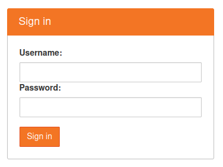

# JupyterHub
JupyterHub is an open-source tool that enables the deployment of multi-user Jupyter Notebook servers. 
With JupyterHub, multiple users can access and collaborate on a shared computing environment.
JupyterHub provides an easy-to-use web interface for managing user accounts, launching notebooks, and managing user environments. Moreover, JupyterHub is highly customizable, allowing administrators to set up authentication and authorization systems, customize user environments, and integrate with other tools and services.

## Login
Authorized users can log in using LDAP. Note that LDAP currently only works for FB02 students.



## Server options
Depending on the user's request, server options for each user can differ. 


:::note
**Default** does not have access to GPU and the storage is ephemeral (not persistent).
:::

:::info
Note that if you have access to shared GPUs, other users may have been using them already.
:::

## Directory structure
```
# Home directory
/home/jovyan

# Userdata directory with a bigger storage for datasets and logs
/home/jovyan/userdata/{username}
```

## Resource usage monitoring

* Monitor GPU usage using nvtop
  ```
  nvtop
  ```

